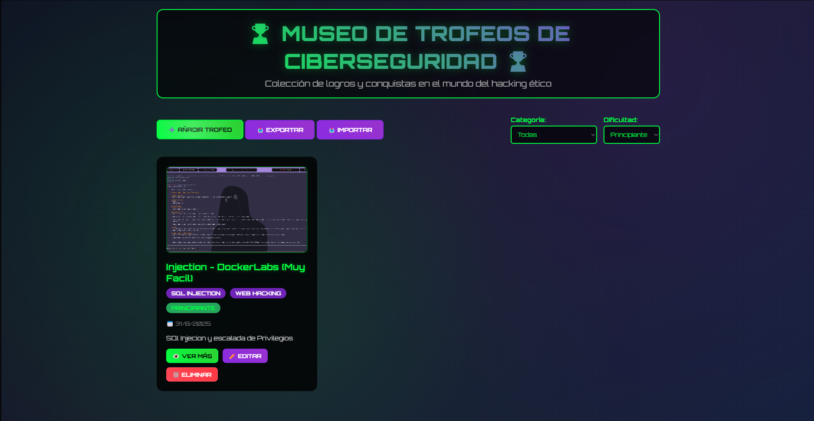
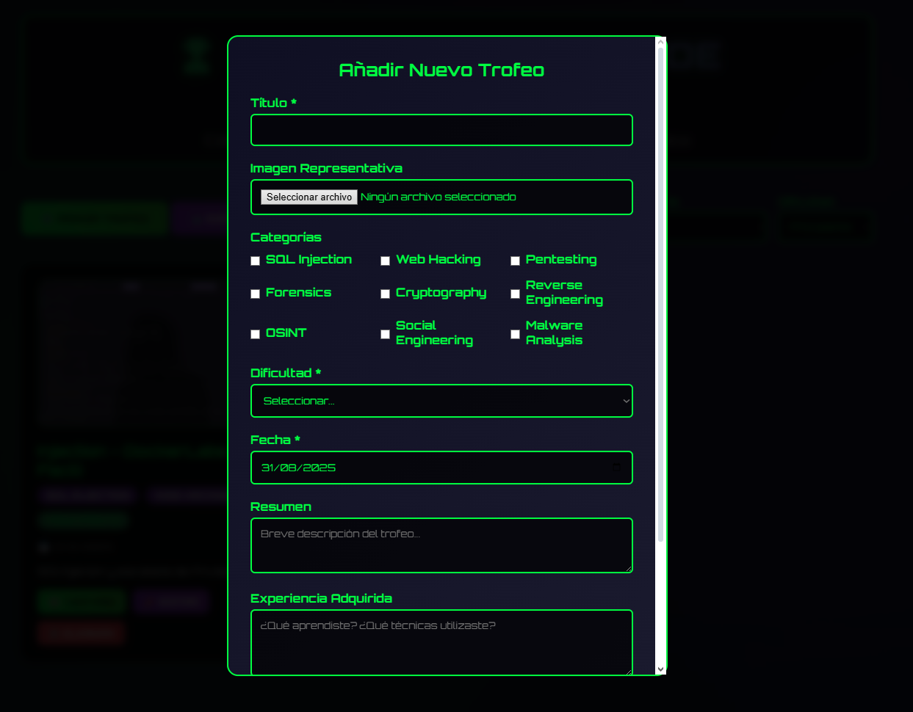
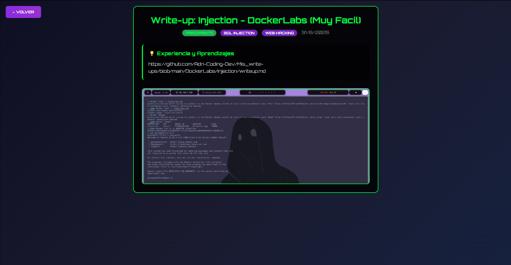

# Galeria de Trofeos de Hacking

  

---

## 🔥 Descripción del Proyecto

**Gallery_Hacking** es una página web interactiva construida con **HTML, CSS y JavaScript**, diseñada para la gestión de trofeos relacionados con hacking y análisis forense. Su estética tiene un **fondo oscuro tipo hacker**, con textos claros y verdes para los títulos principales, y una interfaz moderna con tarjetas y modales interactivos.

Este proyecto permite **añadir, eliminar, filtrar y gestionar trofeos**, manteniendo la información organizada y accesible directamente desde el navegador mediante **localStorage**.

---

## 🎨 Diseño y Estilos

- Fondo oscuro con estética de hacker.
- Textos claros y verdes para títulos principales.
- Tarjetas de trofeos con:
  - Bordes redondeados.
  - Sombras y padding consistente.
  - Espaciado uniforme.
- Botones diferenciados por categoría y dificultad, con efectos **hover**.

---

## ⚡ Funcionalidades Principales

- **Añadir trofeos** con los campos:
  - Título
  - Imagen representativa
  - Categoría (multi-selección)
  - Vector de ataque o tipo de hacking (web, forense, etc.)
  - Dificultad (Principiante, Fácil, Medio, Avanzado, Experto, Master)
  - Fecha
  - Resumen
  - Experiencia
  - Write-up (con posibilidad de subir varias capturas)
- **Eliminar trofeos** con confirmación.
- **Filtrar trofeos** por categoría y dificultad.
- **Exportar e importar** trofeos en formato JSON.
- **Guardar automáticamente** los trofeos en **localStorage**.
- **Mensajes informativos** si no hay trofeos que coincidan con los filtros.
- **Mostrar Write-up** en una página aparte con estética similar a la principal.
- **Ver más detalles** en cada tarjeta mediante un botón, sin mostrar toda la información inicialmente.

---

## 🖥️ Extras de Interfaz

- Añadir trofeos mediante **modales modernos** o prompts personalizados.
- Tarjetas con título destacado, categoría y dificultad visibles.
- Resumen y experiencia en texto claro.
- Botones para:
  - Añadir trofeos
  - Eliminar trofeos
  - Exportar e importar JSON
  - Agregar imágenes
  - Ver Write-up completo

---

## 📂 Estructura de Archivos
```bash
/Gallery_Hacking
│
├─ index.html # Página principal
├─ style.css # Diseño de toda la pagina web
├─ capturas/ # Carpeta para imágenes y capturas
└─ script.js # Script de toda la pagina (Separacion en posibles actualizaciones)
```

## 🖼️ Capturas de Pantalla

### Ventana Principal:

### Agregar Trofeos:

### Vista del Write-up:

## ⚙️ Tecnologías Utilizadas
HTML5

CSS3

JavaScript (ES6+)

localStorage para persistencia de datos

📝 Uso
Clonar el repositorio:

```bash
git clone [https://github.com/tu-usuario/Hacktrophy.git](https://github.com/Adri-Coding-Dev/Galleria_De_Hitos_Ciberseguridad)
```
Abrir index.html en tu navegador.

Añadir, filtrar y gestionar trofeos desde la interfaz.

Exportar e importar trofeos mediante archivos JSON.

Visualizar Write-ups con capturas en la página dedicada.

🔗 Contribuciones
Las contribuciones son bienvenidas. Puedes abrir issues o enviar pull requests para mejorar la interfaz, añadir nuevas funcionalidades o corregir errores.

📄 Licencia
Este proyecto está bajo la licencia MIT. Consulta el archivo LICENSE para más información.
